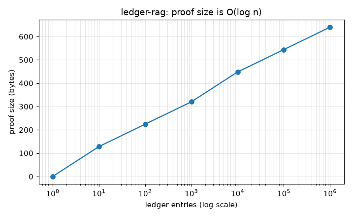
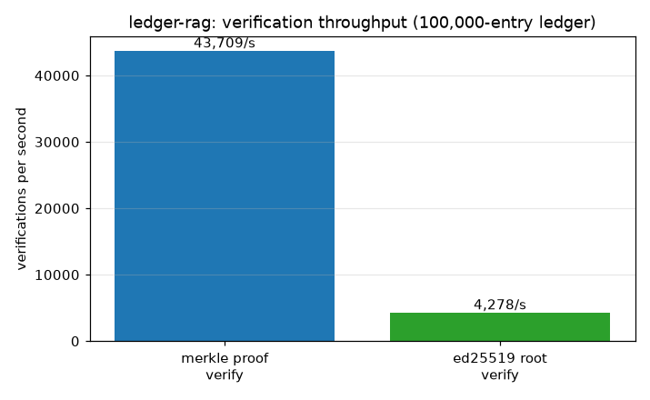

# Benchmarks

Produced by `bench/benchmark.py` (needs `matplotlib`; the ledger itself only needs
`cryptography` for ed25519):

```
python bench/benchmark.py
```

It writes the two graphs below and `bench/results/summary.json`.

## Proof size is O(log n)



An inclusion proof is one sibling hash per tree level, so it grows with the
*logarithm* of the ledger size:

| Ledger entries | Proof steps | Proof size |
|:--------------:|:-----------:|:----------:|
| 1 | 0 | 0 bytes |
| 10 | 4 | 128 bytes |
| 100 | 7 | 224 bytes |
| 1,000 | 10 | 320 bytes |
| 10,000 | 14 | 448 bytes |
| 100,000 | 17 | 544 bytes |
| 1,000,000 | 20 | 640 bytes |

This is the property that makes "every answer ships a proof" practical. Going from a
thousand entries to a million - a thousand-fold increase - only doubles the proof
from 320 to 640 bytes. A proof over a million-entry ledger is 20 hashes; you can
attach it to a response without anyone noticing the payload.

## Verification throughput



Against a 100,000-entry ledger, pure Python:

| Operation | Throughput | Per operation |
|-----------|:----------:|:-------------:|
| Merkle proof verify | ~44,000/sec | ~23 us |
| Ed25519 root verify | ~4,300/sec | ~230 us |

Checking an inclusion proof is just `log n` SHA-256 hashes - about 23 microseconds
even against a 100k-entry ledger, so a verifier can check tens of thousands of
answers a second. The ed25519 root-signature check is the heavier of the two (public
key crypto is inherently pricier than hashing), but at ~4.3k/sec it's still far faster
than the model calls it accompanies. The C# and Java verifiers do the same work with
platform crypto libraries and are faster still.

## Reading these together

The proof-size graph is the load-bearing result: verifiability doesn't get more
expensive as the ledger grows, because a proof is logarithmic in the log's size. The
throughput numbers say the actual checking is cheap enough to do on every answer,
which is the whole point - a proof nobody can afford to verify isn't a proof anyone
uses.
