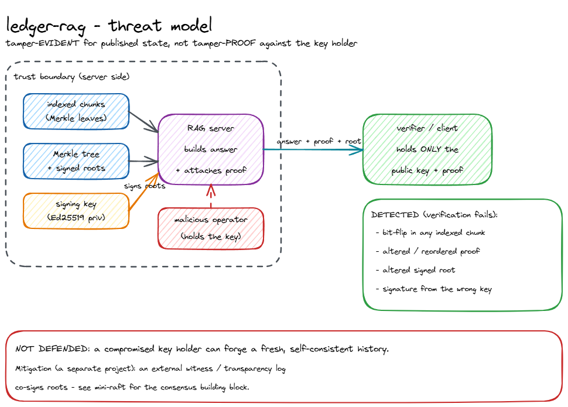
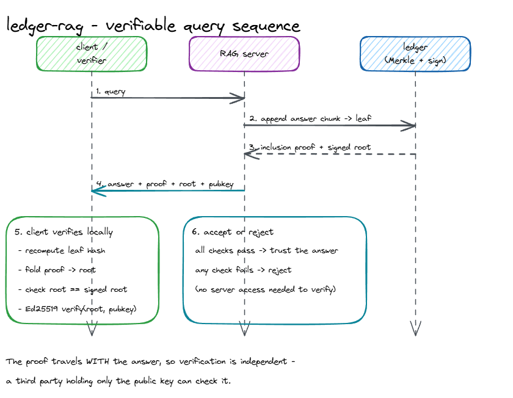

# ledger-rag: design, trade-offs, and non-goals

Status: accepted
Author: Parag Sawant

Why ledger-rag exists and where its guarantee begins and ends. The pitch is
"verifiable RAG - every answer ships a proof," and a claim like that deserves to be
stated precisely, because a tamper-evidence guarantee is only as good as the
threat model behind it.

## Problem and goals

When a RAG system answers a question, you usually have to take it on faith that the
answer was built from the documents it cites and that nobody altered the record
afterward. ledger-rag makes that checkable: every indexed chunk is a leaf in an
append-only Merkle ledger, each new root is signed, and every answer ships an
inclusion proof a third party can verify without trusting the server. Goals:

1. Tamper-evidence: any change to an indexed chunk, a proof, or a signed root is
   detectable by a verifier who only holds the public key and the proof.
2. Append-only history: roots chain to their predecessor and are signed, so the log
   can't be silently rewritten.
3. Cheap verification: proofs are small and fast to check, so verifying is practical
   per answer, and independent - the verifier needs no database access.
4. The verifier is portable (there are C# and Java verifiers) so "check this proof"
   isn't a Python-only operation.

## What "tamper-evident" means here (threat model)

This is the part worth being exact about.

*(Source: [`docs/diagrams/threat-model.excalidraw`](docs/diagrams/threat-model.excalidraw) - open it in [excalidraw](https://aka.ms/excalidraw) to edit.)*

- **What it protects against:** silent modification of indexed content or history.
  If someone flips a bit in a chunk, swaps a proof sibling, alters a root, or forges
  a signature with the wrong key, verification fails. The tamper-fuzz suite asserts
  exactly this across thousands of randomized bit-flips.
- **What it does NOT protect against:** a malicious operator who holds the signing
  key can produce a fresh, internally-consistent history - tamper-evidence is not
  tamper-*proofness*. The value is that any change to already-published,
  already-witnessed state is detectable, and that a third party who has a past signed
  root can prove the log was extended, not rewritten. This is the same model as a
  certificate transparency log, and I call it out rather than overselling "you can't
  fake it."

## Key design decisions

**Merkle inclusion proofs, O(log n).** A proof is the sibling hash at each level from
the leaf to the root - `log2(n)` hashes. That's what makes per-answer verification
cheap: a million-entry ledger produces a 20-hash (640-byte) proof. The benchmark
measures this directly.

**SHA-256 with domain separation between leaves and internal nodes.** Leaves and
internal nodes are hashed with different prefixes so a leaf hash can never be
reinterpreted as an internal node (the classic second-preimage attack on naive
Merkle trees). This is a small thing that's easy to get wrong, so it's explicit.

**Ed25519-signed, chained roots.** Each root is signed over `(root, prev_root,
leaf_count)`, so the signature commits to the log's length and its predecessor -
you can't reorder, truncate, or splice history without breaking a signature.

**The verifier is pure and separable.** Verification needs only the leaf, the proof,
and the trusted root/public key - no index, no server. That's why it ports cleanly to
C# and Java: it's just hashing and one signature check.

The full query path - and where the proof gets attached and checked - looks like this:

*(Source: [`docs/diagrams/verifiable-query-sequence.excalidraw`](docs/diagrams/verifiable-query-sequence.excalidraw).)*

## Trade-offs I made on purpose

- **In-memory ledger, rebuilt on append.** The reference `Ledger` recomputes the tree
  on each append for clarity. A production ledger would use an appendable Merkle
  structure that updates in O(log n); that's a known optimization left out to keep the
  core readable. Called out, not hidden.
- **No external witness / gossip.** Detecting that an *operator* rewrote history
  requires a second party who remembers an old signed root. The chaining makes that
  possible but the witness protocol itself is out of scope.
- **Embeddings and retrieval are deliberately simple.** The point of the project is
  the verifiable ledger, not state-of-the-art retrieval; the RAG layer is honest
  scaffolding around it.

## Non-goals

- **Not tamper-proof against the key holder.** See the threat model. It's
  tamper-*evident* for published state, not a defense against a compromised signer.
- **Not a vector database.** The retrieval layer is minimal on purpose.
- **Not a consensus system.** There's one signer; distributing trust across multiple
  witnesses is a different project.

## Benchmarks

See `BENCHMARKS.md`. Short version: an inclusion proof over a **million** entries is
20 hashes (640 bytes) and grows only logarithmically; the reference verifier checks
~44k proofs/sec and ~4.3k ed25519 root signatures/sec in pure Python. Verification is
cheap enough to ship and check a proof with every answer.
